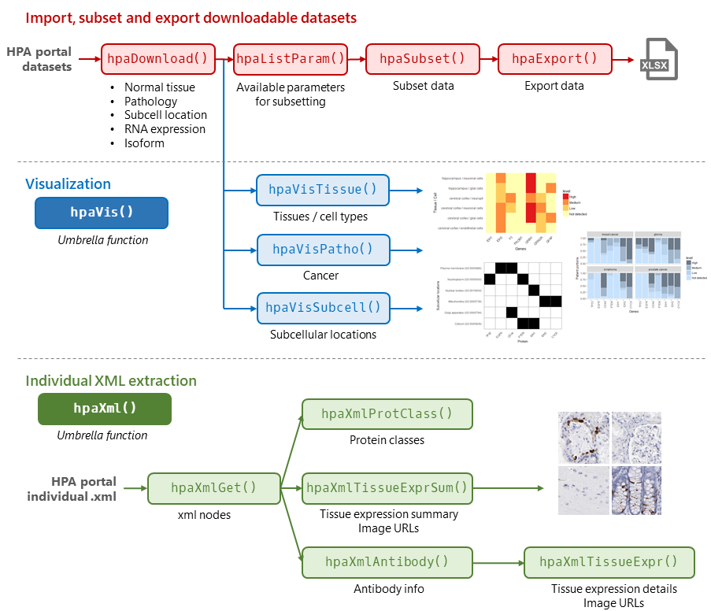
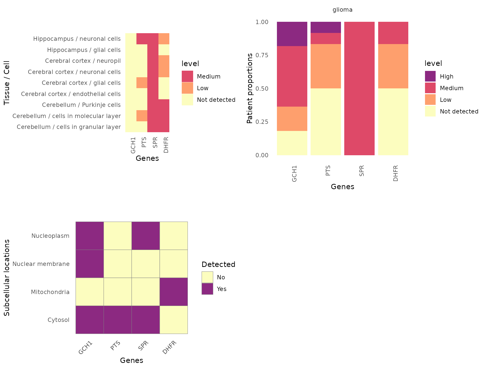
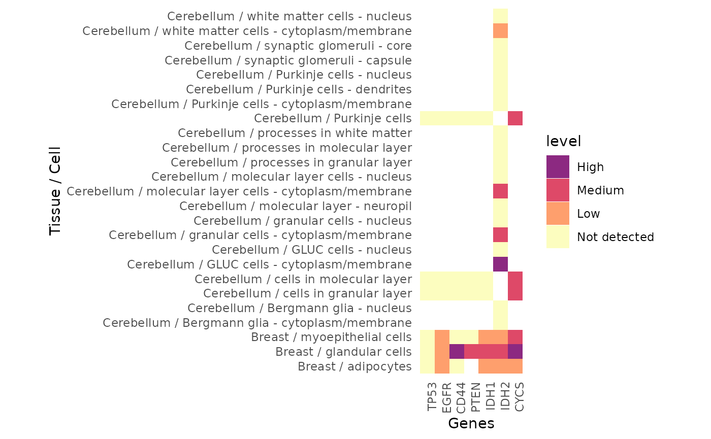
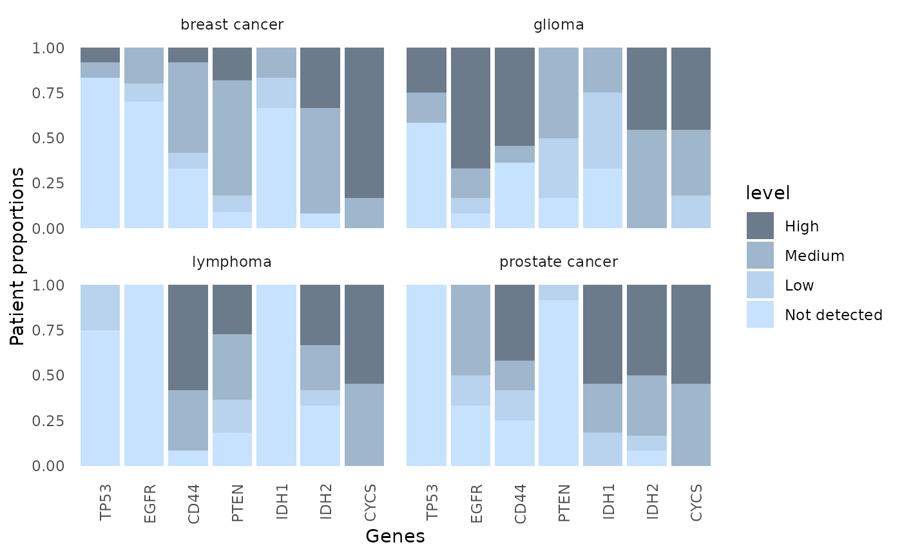
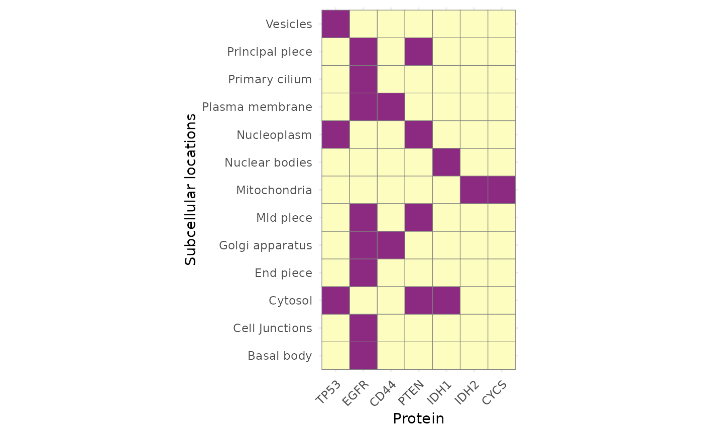

# 2. In-depth: Working with Human Protein Atlas (HPA) data in R with HPAanalyze

``` r

library(HPAanalyze)
library(tibble)
library(dplyr)
library(ggplot2)
```

## Summary

- **Background:** The Human Protein Atlas program aims to map human
  proteins via multiple technologies including imaging, proteomics and
  transcriptomics.
- **Results:** `HPAanalyze` is an R package for retreiving and
  performing exploratory data analysis from HPA. It provides
  functionality for importing data tables and xml files from HPA,
  exporting and visualizing data, as well as download all staining
  images of interest. The package is free, open source, and available
  via Github.
- **Conclusions:** `HPAanalyze` intergrates into the R workflow via the
  `tidyverse` philosophy and data structures, and can be used in
  combination with Bioconductor packages for easy analysis of HPA data.

**Keywords:** Human Protein Atlas, Proteomics, Homo Sapiens,
Visualization, Software

## Background

The Human Protein Atlas (HPA) is a comprehensive resource for
exploration of human proteome which contains a vast amount of proteomics
and transcriptomics data generated from antibody-based tissue
micro-array profiling and RNA deep-sequencing.

The program has generated protein expression profiles in human normal
tissues with cell type-specific expression patterns, cancer and cell
lines via an innovative immunohistochemistry-based approach. These
profiles are accompanied by a large collection of high quality
histological staining images, annotated with clinical data and
quantification. The database also includes classification of protein
into both functional classes (such as transcription factors or kinases)
and project-related classes (such as candidate genes for cancer).
Starting from version 4.0, the HPA includes subcellular location
profiles generated based on confocal images of immunofluorescent stained
cells. Together, these data provide a detailed picture of protein
expression in human cells and tissues, facilitating tissue-based
diagnostic and research.

Data from the HPA are freely available via proteinatlas.org, allowing
scientists to access and incorporate the data into their research.
Previously, the R package *hpar* has been created for fast and easy
programmatic access of HPA data. Here, we introduce *HPAanalyze*, an R
package aims to simplify exploratory data analysis from those data, as
well as provide other complementary functionality to *hpar*.

### The different HPA data formats

The Human Protein Atlas project provides data via two main mechanisms:
*Full datasets* in the form of downloadable compressed tab-separated
files (.tsv) and *individual entries* in XML, RDF and TSV formats. The
full downloadable datasets includes normal tissue, pathology (cancer),
subcellular location and RNA expression data. For individual entries,
the XML format is the most comprehensive, providing information on the
target protein, antibodies, summary for each tissue and detailed data
from each sample including clinical data, IHC scoring and image download
links.

### `HPAanalyze` overview

`HPAanalyze` is designed to fullfill 3 main tasks: (1) Import,
subsetting and export downloadable datasets; (2) Visualization of
downloadable datasets for exploratory analysis; and (3) Working with the
individual XML files. This package aims to serve researchers with little
programming experience, but also allow power users to use the imported
data as desired.



HPAanalyze workflow.

#### Obtaining `HPAanalyze`

The stable version of *HPAanalyze* should be downloaded from
Bioconductor:

    if (!requireNamespace("BiocManager", quietly = TRUE))
        install.packages("BiocManager")
    BiocManager::install("HPAanalyze")

The development version of *HPAanalyze* is available on Github can be
installed with:

    devtools::install_github("anhtr/HPAanalyze")

Please cite: **Tran AN, Dussaq AM, Kennell T, Willey C, Hjelmeland A.
*HPAanalyze: An R Package that Facilitates the Retrieval and Analysis of
The Human Protein Atlas Data*. bioRxiv 355032; doi:
<https://doi.org/10.1101/355032>**

## Full dataset import, subsetting and export

The
[`hpaDownload()`](https://anhtr.github.io/HPAanalyze/reference/hpaDownload.md)
function downloads full datasets from HPA (*specifically, the .tsv
format described above*) and imports them into R as a list of tibbles,
the standard object of `tidyverse`, which can subsequently be subset
with
[`hpaSubset()`](https://anhtr.github.io/HPAanalyze/reference/hpaListParam.md)
and export into .xlsx files with
[`hpaExport()`](https://anhtr.github.io/HPAanalyze/reference/hpaExport.md).
The standard object allow the imported data to be further processed in a
traditional R workflow. The ability to quickly subset and export data
gives researchers the option to use other non-R downstream tools, such
as GraphPad for creating publication-quality graphics, or share a subset
of data containing only proteins of interest.

**You can skip this whole section if you only care about visualization,
unless you need a specific version of the HPA datasets, or the RNA
expression datasets.**

### Download and import data with `hpaDownload()`

This function should be the first thing you use. It give you a list of
data frames containing the datasets you specified, which you can then
feed into other functions in this package.

``` r

# This should give you the latest of everything, but unless you have a lot of RAM and processing power, I would not recomend it.
downloadedData <- hpaDownload(downloadList='all')
summary(downloadedData)

#>                          Length Class  Mode
#> normal_tissue             6     tbl_df list
#> pathology                11     tbl_df list
#> subcellular_location     14     tbl_df list
#> ...
```

#### The “histology” datasets

Most of the time, you will only need the “histology” datasets, which
contain `normal_tissue`, `pathology` (basically cancers) and
`subcellular_location`.

``` r

downloadedData <- hpaDownload(downloadList='histology', version='example')
# version = "example" will load the built-in dataset. That's sufficient for normal usage, and save you some time.
```

The `normal_tissue` dataset contains information about protein
expression profiles in human tissues based on IHC staining. The datasets
contain six columns: `ensembl` (Ensembl gene identifier); `gene` (HGNC
symbol), `tissue` (tissue name); `cell_type` (annotated cell type);
`level` (expression value); `reliability` (the gene reliability of the
expression value).

``` r

tibble::glimpse(downloadedData$normal_tissue, give.attr=FALSE)
#> Rows: 1,199,675
#> Columns: 6
#> $ ensembl     <chr> "ENSG00000000003", "ENSG00000000003", "ENSG00000000003", "…
#> $ gene        <chr> "TSPAN6", "TSPAN6", "TSPAN6", "TSPAN6", "TSPAN6", "TSPAN6"…
#> $ tissue      <chr> "Adipose tissue", "Adrenal gland", "Appendix", "Appendix",…
#> $ cell_type   <chr> "adipocytes", "glandular cells", "glandular cells", "lymph…
#> $ level       <chr> "Not detected", "Not detected", "Medium", "Not detected", …
#> $ reliability <chr> "Approved", "Approved", "Approved", "Approved", "Approved"…
```

The `pathology` dataset contains information about protein expression
profiles in human tumor tissue based on IHC staining. The datasets
contain eleven columns: `ensembl` (Ensembl gene identifier); `gene`
(HGNC symbol); `cancer` (cancer type); `high`, `medium`, `low`,
`not_detected` (number of patients annotated for different staining
levels); `prognostic_favorable`, `unprognostic_favorable`,
`prognostic_unfavorable`, `unprognostic_unfavorable` (log-rank p values
for patient survival and mRNA correlation).

``` r

tibble::glimpse(downloadedData$pathology, give.attr=FALSE)
#> Rows: 306,237
#> Columns: 7
#> $ ensembl      <chr> "ENSG00000000003", "ENSG00000000003", "ENSG00000000003", …
#> $ gene         <chr> "TSPAN6", "TSPAN6", "TSPAN6", "TSPAN6", "TSPAN6", "TSPAN6…
#> $ cancer       <chr> "breast cancer", "carcinoid", "cervical cancer", "colorec…
#> $ high         <int> 1, 0, 11, 0, 10, 0, 0, 4, 8, 0, 0, 8, 11, 5, 2, 9, 11, 0,…
#> $ medium       <int> 7, 1, 1, 6, 2, 0, 3, 5, 4, 0, 1, 3, 1, 6, 4, 2, 1, 1, 0, …
#> $ low          <int> 2, 1, 0, 2, 0, 0, 1, 1, 0, 0, 2, 0, 0, 0, 1, 0, 0, 1, 2, …
#> $ not_detected <int> 2, 2, 0, 2, 0, 11, 0, 0, 0, 11, 9, 0, 0, 0, 5, 0, 0, 10, …
```

The `subcellular_location` dataset contains information about
subcellular localization of proteins based on IF stanings of normal
cells. The datasets contain eleven columns: `ensembl` (Ensembl gene
identifier); `gene` (HGNC symbol); `reliability` (gene reliability
score); `enhanced` (enhanced locations); `supported` (supported
locations); `approved` (approved locations); `uncertain` (uncertain
locations); `single_cell_var_intensity` (locations with single-cell
variation in intensity); `single_cell_var_spatial` (locations with
spatial single-cell variation); `cell_cycle_dependency` (locations with
observed cell cycle dependency); `go_id` (Gene Ontology Cellular
Component term identifier).

``` r

tibble::glimpse(downloadedData$subcellular_location, give.attr=FALSE)
#> Rows: 13,603
#> Columns: 14
#> $ ensembl                   <chr> "ENSG00000000003", "ENSG00000000457", "ENSG0…
#> $ gene                      <chr> "TSPAN6", "SCYL3", "C1orf112", "FGR", "CFH",…
#> $ reliability               <chr> "Approved", "Supported", "Supported", "Appro…
#> $ main_location             <chr> "Cell Junctions;Cytosol", "Cytosol;Golgi app…
#> $ additional_location       <chr> "Nucleoli fibrillar center", NA, "Nucleoli",…
#> $ extracellular_location    <chr> NA, NA, NA, NA, "Predicted to be secreted", …
#> $ enhanced                  <chr> NA, NA, NA, NA, NA, NA, NA, NA, NA, NA, NA, …
#> $ supported                 <chr> NA, "Cytosol;Golgi apparatus", "Nucleoli;Nuc…
#> $ approved                  <chr> "Cell Junctions;Cytosol;Nucleoli fibrillar c…
#> $ uncertain                 <chr> NA, NA, NA, NA, NA, NA, NA, NA, NA, "Basal b…
#> $ single_cell_var_intensity <chr> "Cytosol", NA, NA, NA, NA, "Cytosol;Nucleopl…
#> $ single_cell_var_spatial   <chr> NA, NA, NA, NA, NA, NA, NA, NA, NA, NA, NA, …
#> $ cell_cycle_dependency     <chr> NA, NA, NA, NA, NA, NA, NA, NA, NA, NA, NA, …
#> $ go_id                     <chr> "Cell Junctions (GO:0030054);Cytosol (GO:000…
```

#### Other datasets

HPA provide a large number of other datasets. More details can be find
at <https://www.proteinatlas.org/about/download>. To see how to download
these datasets, please see the help page for `hpaDownload`:

``` r

?hpaDownload
```

### List available parameter for subsetting with `hpaListParam()`

To see what parameters are available for subsequent
subsetting/visualizing, HPAanalyze includes the function
[`hpaListParam()`](https://anhtr.github.io/HPAanalyze/reference/hpaListParam.md).
The input for this function is the output of `hpaDownload`. This
function will only work with normal_tissue, pathology and
subcellular_location datasets.

*If you leave the argument blank, this function will give you the
results for the built-in datasets.*

``` r

## If you use the output from hpaDownload()
downloadedData <- hpaDownload(downloadList=c("normal_tissue", "pathology"))
str(hpaListParam(downloadedData))

# List of 4
#  $ normal_tissue :List of 2
#   ..$ tissue   : chr [1:63] "adipose tissue" "adrenal gland" "appendix" "bone marrow" ...
#   ..$ cell_type: chr [1:120] "adipocytes" "glandular cells" "lymphoid tissue" "hematopoietic cells" ...
#  $ pathology     :List of 1
#   ..$ cancer: chr [1:20] "breast cancer" "carcinoid" "cervical cancer" "colorectal cancer" ...
#  $ rna_tissue_hpa:List of 1
#   ..$ tissue: chr [1:43] "adipose tissue" "adrenal gland" "appendix" "B-cells" ...
#  $ rna_celline   :List of 1
#   ..$ cell_line: chr [1:69] "A-431" "A549" "AF22" "AN3-CA" ...
```

### Subset data with `hpaSubset()`

[`hpaSubset()`](https://anhtr.github.io/HPAanalyze/reference/hpaListParam.md)
filters the output of
[`hpaDownload()`](https://anhtr.github.io/HPAanalyze/reference/hpaDownload.md)
for desirable target genes, tissues, cell types, cancer, and cell lines.
The data will be subset only where applicable (i.e. `normal_tissue` will
not be subset by *cancer*). The main purpose of `hpaSubset` is to
prepare a manageable set of data to be exported. However, this function
may also be useful for other data table manipulation purposes. The input
for `targetGene` argument is a vector of strings of HGNC symbols.

This function will only work with normal_tissue, pathology and
subcellular_location datasets.

*If you leave the `data` argument blank, this function will
automatically subset the built-in dataset, which may not contain all of
the columns available if you download the data with
[`hpaDownload()`](https://anhtr.github.io/HPAanalyze/reference/hpaDownload.md).*

``` r

downloadedData <- hpaDownload(downloadList='histology', version='v23')
sapply(downloadedData, nrow)
#>        normal_tissue            pathology subcellular_location 
#>              1197500               403240                13147
```

``` r

geneList <- c('TP53', 'EGFR', 'CD44', 'PTEN', 'IDH1', 'IDH2', 'CYCS')
tissueList <- c('Breast', 'Cerebellum', 'Skin 1')
cancerList <- c('breast cancer', 'glioma', 'melanoma')
cellLineList <- c('A-431', 'A549', 'AF22', 'AN3-CA')

subsetData <- hpaSubset(data=downloadedData,
                         targetGene=geneList,
                         targetTissue=tissueList,
                         targetCancer=cancerList,
                         targetCellLine=cellLineList)
sapply(subsetData, nrow)
#>        normal_tissue            pathology subcellular_location 
#>                    0                   21                    7
```

### Export data with `hpaExport()`

As the name suggests,
[`hpaExport()`](https://anhtr.github.io/HPAanalyze/reference/hpaExport.md)
exports the output of
[`hpaSubset()`](https://anhtr.github.io/HPAanalyze/reference/hpaListParam.md)
to one .xlsx file, or multiple .csv or .tsv files. Each dataset is
placed in a separate sheet.

``` r

hpaExport(subsetData, fileName='subset.xlsx', fileType='xlsx')
```

## Visualization

`HPAanalyze` provides the ability to quickly visualize data from
downloaded HPA datasets with the `hpaVis` function family. The goal of
these functions is to aid exploratory analysis of a group of target
genes, which maybe particularly useful for gaining insights into
pathways or gene signatures of interest.

The `hpaVis` functions share a common syntax, where the input (`data`
argument) is the output of
[`hpaDownload()`](https://anhtr.github.io/HPAanalyze/reference/hpaDownload.md)
or
[`hpaSubset()`](https://anhtr.github.io/HPAanalyze/reference/hpaListParam.md)
(although they do their own subseting so it is not necessary to use
[`hpaSubset()`](https://anhtr.github.io/HPAanalyze/reference/hpaListParam.md)
unless you want to reduce the size of your data object). Depending on
the function, the `target` arguments will let you choose to visualize
your vectors of genes, tissue, cell types, etc. (See the help files for
more details.) All of `hpaVis` functions generate standard `ggplot2`
plots, which allow you to further customize colors and themes. Colors
maybe changed via the `color` argument, while the default theme maybe
overriden by setting the `customTheme` argument to `FALSE`.

Currently, the `normal_tissue`, `pathology` and `subcellular_location`
data can be visualized, with more functions planned for future releases.

*For all functions in the `hpaVis` family, if you leave the `data`
argument blank, they will plot the built-in datasets by default.*

### Unbrella function `hpaVis()`

`hpaVis` will plot all available plots by default. See the quick-start
vignette for details.

``` r

hpaVis(downloadedData,
       targetGene = c("GCH1", "PTS", "SPR", "DHFR"),
       targetTissue = c("Cerebellum", "Cerebral cortex", "Hippocampus"),
       targetCancer = c("glioma"))
```



### Visualize tissue data with `hpaVisTissue()`

[`hpaVisTissue()`](https://anhtr.github.io/HPAanalyze/reference/hpaVisTissue.md)
generates a “heatmap”, in which the expression of proteins of interest
(quantified IHC staining) are plotted for each cell type of each tissue.

``` r

geneList <- c('TP53', 'EGFR', 'CD44', 'PTEN', 'IDH1', 'IDH2', 'CYCS')
tissueList <- c('Breast', 'Cerebellum', 'Skin 1')

hpaVisTissue(downloadedData,
             targetGene=geneList,
             targetTissue=tissueList)
```



### Visualize expression in cancer with `hpaVisPatho()`

[`hpaVisPatho()`](https://anhtr.github.io/HPAanalyze/reference/hpaVisPatho.md)
generates an arrays of column graphs showing the expression of proteins
of interest in each cancer.

This example also demonstrate how the colors of the graphs could be
customized, which is a common functionality of the `hpaVis` family.

``` r

geneList <- c('TP53', 'EGFR', 'CD44', 'PTEN', 'IDH1', 'IDH2', 'CYCS')
cancerList <- c('breast cancer', 'glioma', 'lymphoma', 'prostate cancer')
colorGray <- c('slategray1', 'slategray2', 'slategray3', 'slategray4')

hpaVisPatho(downloadedData,
            targetGene=geneList,
            targetCancer=cancerList,
            color=colorGray)
```



### Visualize subcellular location data with `hpaVisSubcell()`

[`hpaVisSubcell()`](https://anhtr.github.io/HPAanalyze/reference/hpaVisSubcell.md)
generates a tile chart showing the subcellular locations (approved and
supported) of proteins of interest.

This example also demonstrate the customization of the output plot with
ggplot2 functions, which is applicable to all `hpaVis` functions. Notice
that the `customTheme` argument is set to `TRUE`.

``` r

geneList <- c('TP53', 'EGFR', 'CD44', 'PTEN', 'IDH1', 'IDH2', 'CYCS')

hpaVisSubcell(downloadedData,
              targetGene=geneList,
              customTheme=TRUE) +
    ggplot2::theme_minimal() +
    ggplot2::ylab('Subcellular locations') +
    ggplot2::xlab('Protein') +
    ggplot2::theme(axis.text.x=element_text(angle=45, hjust=1))  +
    ggplot2::theme(legend.position="none") +
    ggplot2::coord_equal()
```



## Individual xml import and image downloading

The `hpaXml` function family import and extract data from individual XML
entries from HPA. The
[`hpaXmlGet()`](https://anhtr.github.io/HPAanalyze/reference/hpaXmlGet.md)
function downloads and imports data as “xml_document”/“xml_node” object,
which can subsequently be processed by other `hpaXml` functions. The XML
format from HPA contains a wealth of information that may not be covered
by this package. However, users can extract any data of interest from
the imported XML file using the xml2 package.

A typical workflow for working with XML files includes the following
steps: (1) Download and import XML file with
[`hpaXmlGet()`](https://anhtr.github.io/HPAanalyze/reference/hpaXmlGet.md);
(2) Extract the desired information with other `hpaXml` functions; and
(3) Download histological staining pictures, which is currently
supported by the `hpaXmlTissurExpr()` and
[`hpaXmlTissueExprSum()`](https://anhtr.github.io/HPAanalyze/reference/hpaXmlTissueExprSum.md)
functions.

### The umbrella function `hpaXml`

`hpaXml` will take an Ensembl gene id (start with *ENSG*) and extract
all availble information. You can also feed the ourput of hpaXmlGet to
it. See the quick-start vignette for more details.

``` r

EGFR <- hpaXml(inputXml='ENSG00000146648')
names(EGFR)

#> [1] "ProtClass"     "TissueExprSum" "Antibody"      "TissueExpr"   
```

### Import xml file with `hpaXmlGet()`

The `hoaXmlGet()` function takes an Ensembl gene id (start with *ENSG*)
and import the perspective XML file into R. This function calls the
[`xml2::read_xml()`](http://xml2.r-lib.org/reference/read_xml.md) under
the hood, hence the resulting object may be processed further with
*xml2* functions if desired.

``` r

EGFRxml <- hpaXmlGet('ENSG00000146648')
```

### View protein classes with `hpaXmlProtClass()`

Protein class of queried protein can be extracted from the imported XML
with
[`hpaXmlProtClass()`](https://anhtr.github.io/HPAanalyze/reference/hpaXmlProtClass.md).
The output of this function is a tibble of 4 columns: `id`, `name`,
`parent_id` and `source`

``` r

hpaXmlProtClass(EGFRxml)

#> # A tibble: 40 x 4
#>    id    name                                   parent_id source    
#>    <chr> <chr>                                  <chr>     <chr>     
#>  1 Ez    Enzymes                                <NA>      <NA>      
#>  2 Ec    ENZYME proteins                        Ez        ENZYME    
#>  3 Et    Transferases                           Ec        ENZYME    
#>  4 Ki    Kinases                                Ez        UniProt   
#>  5 Kt    Tyr protein kinases                    Ki        UniProt   
#>  6 Ma    Predicted membrane proteins            <NA>      MDM       
#>  7 Md    Membrane proteins predicted by MDM     <NA>      MDM       
#>  8 Me    MEMSAT3 predicted membrane proteins    <NA>      MEMSAT3   
#>  9 Mf    MEMSAT-SVM predicted membrane proteins <NA>      MEMSAT-SVM
#> 10 Mg    Phobius predicted membrane proteins    <NA>      Phobius   
#> # ... with 30 more rows
```

### Get summary and images of tissue expression with `hpaXmlTissueExprSum()`

The function
[`hpaXmlTissueExprSum()`](https://anhtr.github.io/HPAanalyze/reference/hpaXmlTissueExprSum.md)
extract the summary of expression of protein of interest in normal
tissue. The output of this function is a list of (1) a string contains
one-sentence summary and (2) a dataframe of all tissues in which the
protein was stained positive and a histological stain images of those
tissue.

``` r

hpaXmlTissueExprSum(EGFRxml)

#> $summary
#> [1] "Cytoplasmic and membranous expression in several tissues, most abundant in placenta."
#> 
#> $img
#>            tissue
#> 1 cerebral cortex
#> 2      lymph node
#> 3           liver
#> 4           colon
#> 5          kidney
#> 6          testis
#> 7        placenta
#>                                                                imageUrl
#> 1 http://v18.proteinatlas.org/images/18530/41191_B_7_5_rna_selected.jpg
#> 2 http://v18.proteinatlas.org/images/18530/41191_A_7_8_rna_selected.jpg
#> 3 http://v18.proteinatlas.org/images/18530/41191_A_7_4_rna_selected.jpg
#> 4 http://v18.proteinatlas.org/images/18530/41191_A_9_3_rna_selected.jpg
#> 5 http://v18.proteinatlas.org/images/18530/41191_A_9_5_rna_selected.jpg
#> 6 http://v18.proteinatlas.org/images/18530/41191_A_6_6_rna_selected.jpg
#> 7 http://v18.proteinatlas.org/images/18530/41191_A_1_7_rna_selected.jpg
```

Those images can be downloaded automatically by setting the
`downloadImg` argument to `TRUE`. Eg.
`hpaXmlTissueExprSum(CCNB1xml, downloadImg=TRUE)`

### Get details of individual IHC samples with `hpaXmlAntibody()` and `hpaXmlTissueExpr()`

More importantly, the XML files are the only format of HPA
programmatically accesible data which contains information about each
antibody and each tissue sample used in the project.

[`hpaXmlAntibody()`](https://anhtr.github.io/HPAanalyze/reference/hpaXmlAntibody.md)
extract the antibody information and return a tibble with one row for
each antibody.

``` r

hpaXmlAntibody(EGFRxml)

#> # A tibble: 5 x 4
#>   id        releaseDate releaseVersion RRID      
#>   <chr>     <chr>       <chr>          <chr>     
#> 1 CAB000035 2006-03-13  1.2            <NA>      
#> 2 HPA001200 2008-02-15  3.1            AB_1078723
#> 3 HPA018530 2008-12-03  4.1            AB_1848044
#> 4 CAB068186 2014-11-06  13             AB_2665679
#> 5 CAB073534 2015-10-16  14             <NA>
```

[`hpaXmlTissueExpr()`](https://anhtr.github.io/HPAanalyze/reference/hpaXmlTissueExpr.md)
extract information about all samples for each antibody above and return
a list of tibbles. If antibody has not been used for IHC staining, the
returned tibble with be empty.

``` r

tissueExpression <- hpaXmlTissueExpr(EGFRxml)
summary(tissueExpression)

#>      Length Class  Mode
#> [1,] 18     tbl_df list
#> [2,] 18     tbl_df list
#> [3,] 18     tbl_df list
#> [4,] 18     tbl_df list
#> [5,] 18     tbl_df list
```

Each tibble contain clinical data (`patientid`, `age`, `sex`), tissue
information (`snomedCode`, `tissueDescription`), staining results
(`staining`, `intensity`, `location`) and one `imageUrl` for each
sample. However, due to the large amount of data and the relatively
large size of each image, `hpaXmlTissueExpr` does not provide an
automated download option.

``` r

tissueExpression[[1]]

#> # A tibble: 327 x 18
#>    patientId age   sex   staining intensity quantity location imageUrl
#>    <chr>     <chr> <chr> <chr>    <chr>     <chr>    <chr>    <chr>   
#>  1 1653      53    Male  <NA>     <NA>      <NA>     <NA>     http://~
#>  2 1721      60    Fema~ <NA>     <NA>      <NA>     <NA>     http://~
#>  3 1725      57    Male  <NA>     <NA>      <NA>     <NA>     http://~
#>  4 4         25    Male  <NA>     <NA>      <NA>     <NA>     http://~
#>  5 512       34    Fema~ <NA>     <NA>      <NA>     <NA>     http://~
#>  6 2664      74    Fema~ <NA>     <NA>      <NA>     <NA>     http://~
#>  7 2665      88    Fema~ <NA>     <NA>      <NA>     <NA>     http://~
#>  8 1391      54    Fema~ <NA>     <NA>      <NA>     <NA>     http://~
#>  9 1447      45    Fema~ <NA>     <NA>      <NA>     <NA>     http://~
#> 10 1452      44    Fema~ <NA>     <NA>      <NA>     <NA>     http://~
#> # ... with 317 more rows, and 10 more variables: snomedCode1 <chr>,
#> #   snomedCode2 <chr>, snomedCode3 <chr>, snomedCode4 <chr>,
#> #   snomedCode5 <chr>, tissueDescription1 <chr>, tissueDescription2 <chr>,
#> #   tissueDescription3 <chr>, tissueDescription4 <chr>,
#> #   tissueDescription5 <chr>
```

`hpaTissueExprSum` and `hpaTissueExpr` provide download links to
download relevant staining images, with the former function also gives
the options to automate the downloading process.

### Parse everything with `hpaXmlParse()`

The functions above each extract one specific, hand-picked piece of
information. The xml files also contain other data these functions don’t
cover (RNA expression, protein structure predictions, single-cell type
expression, and more, with new sections added by HPA on almost every
release).
[`hpaXmlParse()`](https://anhtr.github.io/HPAanalyze/reference/hpaXmlParse.md)
generically parses the entire imported xml document, based on the schema
at <https://www.proteinatlas.org/download/proteinatlas.xsd>, into a flat
list of joinable tibbles. See the [“Parse an entire HPA xml file into
relational
tibbles”](https://anhtr.github.io/HPAanalyze/articles/g_HPAanalyze_case_relational_xml.md)
vignette for details.

``` r

EGFR_all <- hpaXmlParse(EGFRxml)
names(EGFR_all)
```

## Searching HPA data

[`hpaSearch()`](https://anhtr.github.io/HPAanalyze/reference/hpaSearch.md)
queries the [HPA search API](https://www.proteinatlas.org/search)
directly from R, equivalent to searching at proteinatlas.org and
downloading the resulting tsv file, but without leaving R. It’s a
convenient way to find genes of interest – by name or by an advanced
field query – before feeding them into the rest of `HPAanalyze`.

``` r

hpaSearch(search = "TP53", columns = c("g", "gs", "eg"))

#> # A tibble: 1 x 3
#>   Gene  `Gene synonym` Ensembl
#>   <chr> <chr>          <chr>
#> 1 TP53  LFS1, p53      ENSG00000141510
```

By default, the HPA search itself always matches partial and related
terms (e.g. searching `"TP53"` also returns `"TP53BP1"` and other
related genes); set `exact = TRUE` to filter the result down to rows
whose `Gene` column is an exact match.
[`hpaSearch()`](https://anhtr.github.io/HPAanalyze/reference/hpaSearch.md)
also accepts the same advanced field query syntax used by the website’s
“Fields \>\>” query builder:

``` r

hpaSearch(
  search = "protein_class:CD markers AND normal_expression:Cerebral cortex;Any;Not detected,Low",
  columns = c("g", "gs", "eg")
)
```

See <https://www.proteinatlas.org/about/help/dataaccess> for the full
list of column codes and query syntax, the [“Combine HPAanalyze with
your HPA
queries”](https://anhtr.github.io/HPAanalyze/articles/c_HPAanalyze_case_query.md)
vignette for the equivalent manual/browser-based workflow, and the
[“Search the Human Protein Atlas with
hpaSearch()”](https://anhtr.github.io/HPAanalyze/articles/h_HPAanalyze_case_search.md)
vignette for a full tutorial, including how to feed the results straight
into `hpaVis` and the `hpaXml` functions.

## Compatibility with `hpar` Bioconductor package

| Functionality | hpar | HPAanalyze |
|---:|:---|:---|
| Datasets | Included in package | Download from server or use built-in dataset |
| Query | Ensembl id | HGNC symbol for datasets, Ensembl id for XML |
| Data version | One stable version | Latest by default, option to download older |
| Release info | Access via functions | N/A |
| View relevant browser page | Via `getHPA` function | N/A |
| Visualization | N/A | Exploratory via `hpaVis` functions |
| XML | N/A | Download and import via `hpaXml` functions |
| Histology image | View by loading browser page | Extract links via `hpaXml` functions |
| Search | N/A | Query the HPA search API via [`hpaSearch()`](https://anhtr.github.io/HPAanalyze/reference/hpaSearch.md) |

(#tab:table) Complementary functionality between hpar and HPAanalyze
{.table}

## Acknowledgements

We appreciate the support of the National institutes of Health National
Cancer Institute R01 CA151522 and funds from the Department of Cell,
Developmental and Integrative Biology at the University of Alabama at
Birmingham.

## Copyright

**Anh Tran, 2018-2025**

Please cite: **Tran, A.N., Dussaq, A.M., Kennell, T. et al. HPAanalyze:
an R package that facilitates the retrieval and analysis of the Human
Protein Atlas data. BMC Bioinformatics 20, 463 (2019)
<https://doi.org/10.1186/s12859-019-3059-z>**
