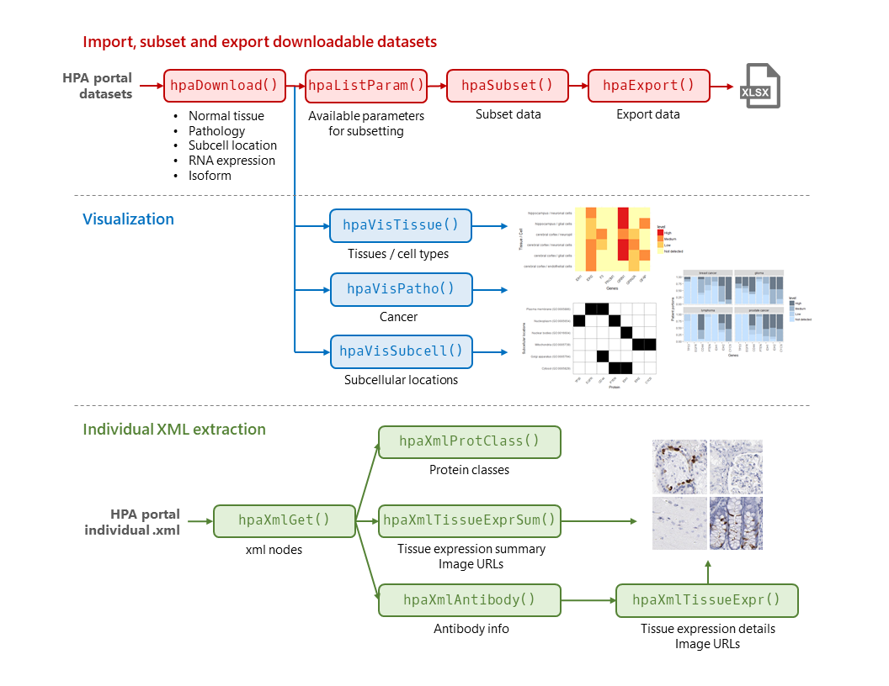

```{r setup, include=FALSE}
knitr::opts_chunk$set(
  collapse=TRUE,
  comment="#>",
  warning=FALSE,
  message=FALSE,
  error=FALSE
)
```

```{r library}
library(BiocStyle)
library(HPAanalyze)
library(tibble)
library(dplyr)
library(ggplot2)
library(hpar)
```


# Summary

* **Background:** The Human Protein Atlas program aims to map human proteins via multiple technologies including imaging, proteomics and transcriptomics.
* **Results:** `HPAanalyze` is an R package for retreiving and performing exploratory data analysis from HPA. It provides functionality for importing data tables and xml files from HPA, exporting and visualizing data, as well as download all staining images of interest. The package is free, open source, and available via Github.
* **Conclusions:** `HPAanalyze` intergrates into the R workflow via the `tidyverse` philosophy and data structures, and can be used in combination with Bioconductor packages for easy analysis of HPA data.  
    
**Keywords:** Human Protein Atlas, Proteomics, Homo Sapiens, Visualization, Software

# Background

The Human Protein Atlas (HPA) is a comprehensive resource for exploration of human proteome which contains a vast amount of proteomics and transcriptomics data generated from antibody-based tissue micro-array profiling and RNA deep-sequencing. 

The program has generated protein expression profiles in human normal tissues with cell type-specific expression patterns, cancer and cell lines via an innovative immunohistochemistry-based approach. These profiles are accompanied by a large collection of high quality histological staining images, annotated with clinical data and quantification. The database also includes classification of protein into both functional classes (such as transcription factors or kinases) and project-related classes (such as candidate genes for cancer). Starting from version 4.0, the HPA includes subcellular location profiles generated based on confocal images of immunofluorescent stained cells. Together, these data provide a detailed picture of protein expression in human cells and tissues, facilitating tissue-based diagnostis and research.

Data from the HPA are freely available via proteinatlas.org, allowing scientists to access and incorporate the data into their research. Previously, the R package *hpar* has been created for fast and easy programmatic access of HPA data. Here, we introduce *HPAanalyze*, an R package aims to simplify exploratory data analysis from those data, as well as provide other complementary functionality to *hpar*.

# Workflow

```{r workflow, echo=FALSE, fig.cap="A typical HPAanalyze workflow", out.width = '100%'}

```

## Import, subset and export downloadable datasets

```{r}

```

## Visualization

```{r}

```

## Individual XML extraction

```{r}

```


# Availability and requirements

* Project name: HPAanalysis
* Project home page: https://github.com/trannhatanh89/HPAanalyze
* Operating system(s): All platforms where R is available, including Windows, Linux, OS X
* Programming language: R
* Other requirements: R 3.5.0 or higher, and the R packages dplyr,     XLConnect, ggplot2, readr, tibble, xml2, reshape2, tidyr, stats, utils, and hpar
* License: MIT
* Any restrictions to use by non-academics: Freely available to everyone

# Abbreviations

HPA: The Human Protein Atlas; XML: Extensible Markup Language

# Declarations

## Acknowledgements

We appreciate the support of the National institutes of Health National Cancer Institute R01 CA151522 and funds from the Department of Cell, Developmental and Integrative Biology at the University of Alabama at Birmingham.

## Authors' contributions

ANT created the R package and drafted the manuscript. ABH supervised the project and revised the manuscript. All authors read and approved the final manuscript.

# References

TBA

# Copyright
© Anh Tran et al. 2018

# Session info
```{r echo=FALSE}
sessionInfo()
```

