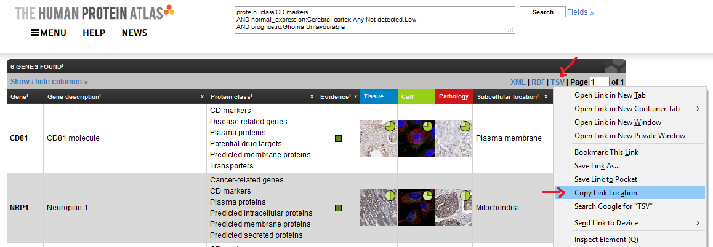

```{r setup, include=FALSE}
knitr::opts_chunk$set(
  collapse=TRUE,
  comment="#>",
  warning=FALSE,
  error=FALSE,
  eval=FALSE,
  crop = NULL
)
```

```{r library, message=FALSE, warning=FALSE, error=FALSE}
library(BiocStyle)
library(HPAanalyze)
library(dplyr)
library(tibble)
library(readr)
library(tidyr)
```

# The case 

The Human Protein Atlas web interface provides a powerful way to search using specific parameters. For example, you can find proteins predicted to be secreted, expressed at low level in normal breast tissue and are predictors of poor prognosis in breast cancer. The good news: you can combine the results of your queries with HPAanalyze for easy explanatory data analysis and data retrieval of your proteins of interest. Here is how.

# The solution

## Create your query

Have a specific goal in mind. What are you looking for? In this example, I will look for CD markers that have low expression in the cerebral cortex and correlate with unfavorable prognosis in glioma.

1. Visit https://www.proteinatlas.org/search.

2. Build your query. The most intuitive way is to click on the "Fields >>" button and use the drop-down menus.

```{r echo=FALSE, eval=TRUE, fig.cap="The 'Fields >>' button.", out.width = '100%'}

```
```{r echo=FALSE, eval=TRUE, fig.cap="Build your query with the drop-down menus.", out.width = '100%'}
knitr::include_graphics("figures/query_dropdown.png")
```

3. Click "Search". The website will show you a list of proteins that match your parameters.

```{r echo=FALSE, eval=TRUE, fig.cap="Click the 'Search' button.", out.width = '100%'}
knitr::include_graphics("figures/query_search.png")
```

4. Copy the link to the tsv file that summarizes your search. (Alternatively, you can just add `?format=tsv` to your search link.)

```{r echo=FALSE, eval=TRUE, fig.cap="Copy the link to the tsv file.", out.width = '100%'}

```

5. Import the tsv file as a data frame as below:

```{r}
## The link to your query tsv
my_hpa_query <- "https://www.proteinatlas.org/search/protein_class%3ACD+markers+AND+normal_expression%3ACerebral+cortex%3BAny%3BNot+detected%2CLow+AND+prognostic%3AGlioma%3BUnfavourable?format=tsv"

## Create a temporary file as destination for the download
temp <- tempfile("query", fileext=c(".tsv.gz"))

## Download to the temporary file
download.file(url=my_hpa_query, destfile = temp, method = "curl", mode = "wb")

## read the file into a data frame
query_df <- readr::read_tsv(temp)

## Unlink the temp file
unlink(temp)
```

**Note: If you have problem downloading file in R (step 5), you can workaround by manually download the tsv.gz file from your browser, unzip with 7zip or WinRAR and import the resulting tsv file.**

You will end up with a data frame that looks like this.

```{r}
tibble::glimpse(query_df)

#> Observations: 6
#> Variables: 22
#> $ Gene                        <chr> "CD81", "NRP1", "PRNP", "SDC1", "THY...
#> $ `Gene synonym`              <chr> "TAPA-1, TAPA1, TSPAN28", "CD304, NR...
#> $ Ensembl                     <chr> "ENSG00000110651", "ENSG00000099250"...
#> $ `Gene description`          <chr> "CD81 molecule", "Neuropilin 1", "Pr...
#> $ Chromosome                  <dbl> 11, 10, 20, 2, 11, 17
#> $ Position                    <chr> "2376177-2397419", "33177492-3333626...
#> $ `Protein class`             <chr> "CD markers, Disease related genes, ...
#> $ Evidence                    <chr> "Evidence at protein level", "Eviden...
#> $ Antibody                    <chr> "CAB002507, HPA007234", "CAB004511, ...
#> $ `Reliability (IH)`          <chr> "Supported", "Approved", "Enhanced",...
#> $ `Reliability (Mouse Brain)` <lgl> NA, NA, NA, NA, NA, NA
#> $ `Reliability (IF)`          <chr> "Supported", "Uncertain", "Approved"...
#> $ `Subcellular location`      <chr> "Plasma membrane", "Mitochondria", "...
#> $ `Prognostic p-value`        <chr> "Glioma:5.12e-5 (unfavourable), Panc...
#> $ `RNA cancer category`       <chr> "Expressed in all", "Expressed in al...
#> $ `RNA tissue category`       <chr> "Expressed in all", "Expressed in al...
#> $ `RNA TS`                    <lgl> NA, NA, NA, NA, NA, NA
#> $ `RNA TS TPM`                <chr> NA, NA, NA, "esophagus: 250.7;skin: ...
#> $ `TPM max in non-specific`   <chr> "seminal vesicle: 2273.0", "placenta...
#> $ `RNA cell line category`    <chr> "Cell line enhanced", "Cell line enh...
#> $ `RNA CS`                    <lgl> NA, NA, NA, NA, NA, NA
#> $ `RNA CS TPM`                <chr> "ASC diff: 2031.3", "U-87 MG: 437.4"...
```

The data frame itself is somewhat informative, and is adequate if you want to see a summary of the data. However, it also provides you with a list of proteins in both "gene name" and "ensembl id" formats which you can use with `HPAanalyze` functions.

## Visualization

You can use the gene names in the list to visualize HPA data with the `hpaVis` function family. No special adjustment is needed.

```{r}
## since the query give you the latest HPA version, get the latest datasets to match
latest_datasets <- hpaDownload()

hpaVis(data = latest_datasets,
       targetGene = query_df$Gene,
       targetTissue = "cerebral cortex",
       targetCancer = "glioma")
```


## XML extraction

Similarly, you can extract the information you want from relevant xml files using `lapply` on the ensembl ids. With some trickery, you can even create a tidy data frame from the extracted information, as shown below. Now you can analyze the way you want.

```{r}
## Download and import the xml files for proteins of interest
query_xml_list <- lapply(query_df$Ensembl, hpaXmlGet)

## Extract protein classes as a list of data frame
query_protein_classes <- lapply(query_xml_list, hpaXmlProtClass)
names(query_protein_classes) <- query_df$Gene # name list items

## Turn the list into a data frame
query_protein_classes_df <- 
    tidyr::unnest(tibble::enframe(query_protein_classes, name = "protein"))

glimpse(query_protein_classes_df)

#> Observations: 122
#> Variables: 5
#> $ protein   <chr> "CD81", "CD81", "CD81", "CD81", "CD81", "CD81", "CD81"...
#> $ id        <chr> "Cd", "Ja", "Jf", "Ma", "Md", "Me", "Mf", "Mg", "Mh", ...
#> $ name      <chr> "CD markers", "Transporters", "Accessory Factors Invol...
#> $ parent_id <chr> NA, NA, "Ja", NA, NA, NA, NA, NA, NA, NA, NA, NA, NA, ...
#> $ source    <chr> "UniProt", "TCDB", "TCDB", "MDM", "MDM", "MEMSAT3", "M...


## Which proteins in our list are also potential drug targets?
filter(query_protein_classes_df, name == "Potential drug targets")

#> # A tibble: 2 x 5
#>   protein id    name                   parent_id source
#>   <chr>   <chr> <chr>                  <chr>     <chr> 
#> 1 CD81    Pd    Potential drug targets <NA>      HPA   
#> 2 PRNP    Pd    Potential drug targets <NA>      HPA
```

*It is even more impressive when you extract patient's detail of multiple genes using `hpaXmlTissueExpr`. You can match samples from the same patient across multiple antibodies and proteins. However, it will take a little bit more work than the above example, so I will leave it to you to explore these hidden potentials."*

# Copyright

__Anh Tran, 2018-2021 __

Please cite: __Tran, A.N., Dussaq, A.M., Kennell, T. et al. HPAanalyze: an R package that facilitates the retrieval and analysis of the Human Protein Atlas data. BMC Bioinformatics 20, 463 (2019) https://doi.org/10.1186/s12859-019-3059-z __
